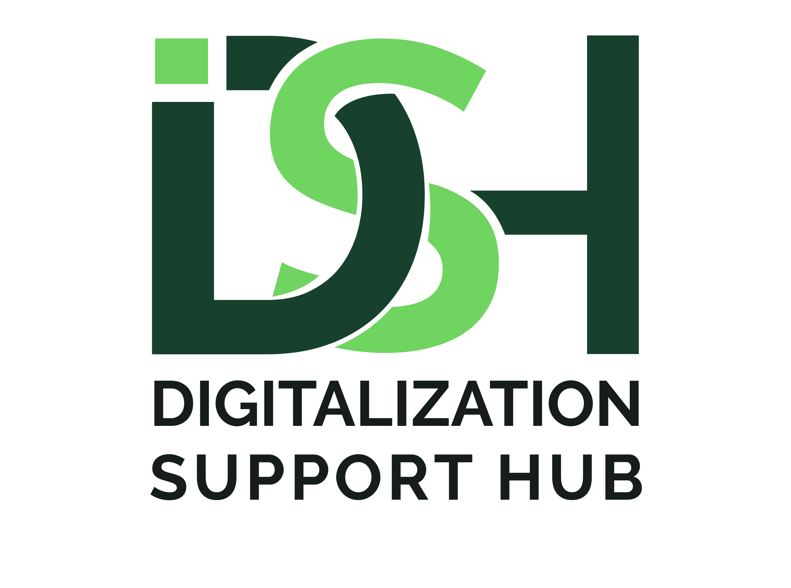

<div align="center">
  
</div>

# Digitalization Support Hub

An intuitive, user-friendly, interactive open-source map of digital tools for Distributed Renewable Energy (DRE) companies providing.
It features a built-in "wizard" to assist businesses in selecting the most suitable tools for their needs.

For context: The digitalization of DRE companies' activities is a precondition to their operational efficiency and scalability.

Hence, it is required to achieve Sustainable Development Goal 7 (Universal access to reliable and affordable energy)
Despite the widespread availability of digital tools, these technologies are underutilized in operations, management, remote monitoring, reporting, and verification (MRV), particularly in domestic and small DRE companies.

## 🚀 Tech Stack

- **Framework**: [Next.js](https://nextjs.org/) (React-based)
- **Language**: TypeScript
- **Styling**: Tailwind CSS & shadcn
- **Package Manager**: npm
- **Deployment**: github pages

---

## 🛠️ Setup & Local Development

To get started with local development, make sure you have the following installed on your machine:

- [Node.js and npm](https://nodejs.org/) (npm comes bundled with Node.js)

### 1. Clone the Repository

```bash
git clone https://github.com/EnAccess/digitalization-support-hub.git

2. Install Dependencies
Using npm:

npm install
Or using yarn:

yarn
3. Run the Development Server
Using npm:


npm run dev
Or using yarn:

yarn dev

The application should now be running at:  http://localhost:3000

```
